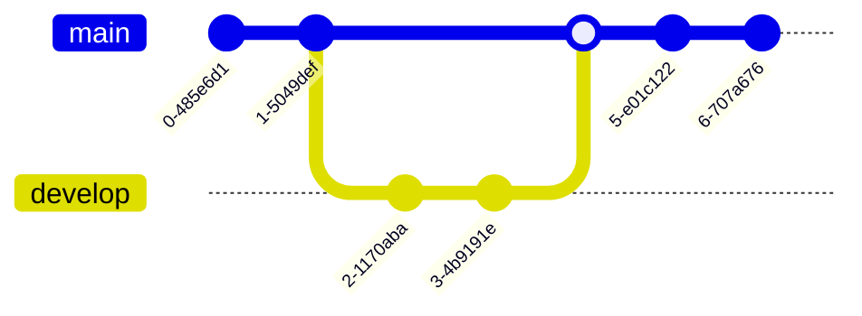

# This is title

## And a sub title

Then the rest of the [page](/getting-started)

## I can try

### To put more things

---

:+1: :joy: :rocket:

```go
// This is my test code
func hello() {
    fmt.Println("Hello")
}

hello()
```





